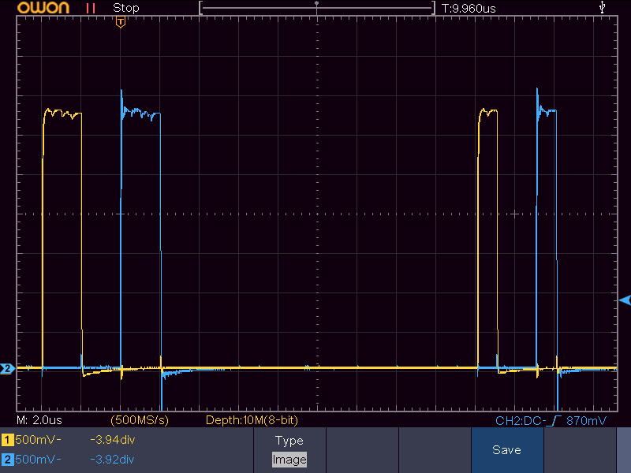

2026-01-31
# ATtiny85 C + ASM

## Demo AVR assemblyn ja C:n yhdistämisestä

Aikani olen ATtiny85:llä assemblyä naputellut, ja vähitellen tekisi mieli hoitaa tietyt osat ns. helpomman kaavan kautta.
Tykkään kyllä AVR assemblystä, se on kivan suoraviivaista ja tietää mitä suoritin tekee, mutta esim. looppirakenteiden käsin naputtelu alkaa olla vähän puuduttavaa. Aika tutustua eri kielten sekoittamiseen.

Etenkin ATtiny-sarjassa ohjelmamuistia on aika tosi vähän, eli ihan täysin ei kannata assemblystä irtautua. Tässä käytetyssä [ATtiny85:ssä](https://www.microchip.com/en-us/product/ATtiny85) sitä on aika reilusti (8 kt) mutta esim. [ATtiny10](https://www.microchip.com/en-us/product/ATtiny10) mahtuu 1 kt ja [ATtiny4](https://www.microchip.com/en-us/product/attiny4) 512 tavua. Menee aika äkkiä siihen ettei ole varaa roikottaa mukana turhia komentoja, vaikkei suoritusnopeudella olisikaan niin väliä.

## Demon rakenne

Demossa ATtiny85 laitetaan sylkemään pulsseja oikeanpuoleisista pinneistään (PINB0, PINB1, PINB2). Demofunktio ottaa talteen pinnien tilan kutsuhetkellä, lähettää pinneistä järjestyksessä lyhyen pulssin ja lopuksi palauttaa pinneihin kutsumahetken tilan.

Demokoodi on jaettu kahteen osaan:
- `main.c`: päälooppi ja C-toteutus pulssifunktiosta
- `isr.S`: interrupt-vektori, laitteen alustus ja assembly-toteutus pulssifunktiosta

Lisäksi tarvitaan
- `linker.ld`: linkkeriskripti, jolla saadaan koodit oikeisiin osoitteisiin (interrupt-vektori osoitteeseen `0x0000`)
- `Makefile`: käännösrutiinit ja muutama aputoiminto
    - `make send` kääntää ja lähettää lopputuloksen sirulle
    - `make show` näyttää käännöstuloksen rakenteen (`objdump` ja binääri heksana)
    - `make clean` kääntää ja poistaa väliaikatiedostot
    - `make clear` poistaa käännöstulokset

Käännösohjelmana toimii [avr-gcc](https://github.com/avrdudes/avr-libc/) ja itse siru ohjelmoidaan [USB-väylän härpäkkeellä avrdude kautta](https://learn.sparkfun.com/tutorials/pocket-avr-programmer-hookup-guide/all).

## Lopputulos

Kyllä, on mahdollista yhdistää assemblyä ja C:tä, mutta pitää jokusessa jutussa olla tarkkana (ks. [opitut oppitunnit](https://github.com/Pilperi/attiny85-c-asm?tab=readme-ov-file#opitut-oppitunnit)).
Yhdistäminen toimii huomattavasti paremmin jos tekee vain muutamia hassuja funktioita assemblyllä ja kutsuu niitä sitten C puolelta, eikä esim. interruptivektorin logiikkaa johtuen `avr-gcc`:n halusta pistää omat versionsa paikoilleen. Pelkkien funktioiden kanssa ei (välttämättä) tarvitse säätää per-projekti olevien linkkeriskriptien kanssa.

Ihan jo tässä yksinkertaisessa pulssidemossa näkyy, että C-toteutus tekee tiettyjä kompromisseja nopeuden ja kooditilan välillä. Käännösflagina on `-Os` eli pyritään optimoimaan viety tila, mutta koodin saisi kyllä pienemmäksikin jos vähän tinkisi nopeudesta.

**Assembly-toteutus** käyttää erityistä `SBI`-ohjetta, joka asettaa rekisteristä yksittäisen bitin ykköseksi. `SBI` voi käyttää vain SRAM-puolen 32 alimpaan rekisteriin, mutta esim. kontrollirekisterit `PORTB` (pinnien asetusarvot), `DDRB` (pinnisuunnat) ja `PINB` (pinnien arvot) sijaitsee kaikki siellä. `PINB`:llä on lisäksi erikoisominaisuus että kun sen tiettyyn bittiin kirjoittaa `1`, vastaava portti vaihtaa tilaa. Tällöin pulssijonon saa tuotettua nätin kompaktisti:
```
00000034 <pulse_pinb_asm>:
  34:	28 b3       	in	r18, 0x18	; Lue PORTB
  36:	18 ba       	out	0x18, r1	; Nollaa PORTB
  38:	b0 9a       	sbi	0x16, 0	    ; Aseta PINB bitti 0 ykköseksi (vaihda PINB0 alhaalta ylös)
  3a:	b0 9a       	sbi	0x16, 0	    ; Aseta PINB bitti 0 ykköseksi (vaihda PINB0 ylhäältä alas)
  3c:	b1 9a       	sbi	0x16, 1	    ; PINB1
  3e:	b1 9a       	sbi	0x16, 1     ; ...
  40:	b2 9a       	sbi	0x16, 2	    ; PINB2
  42:	b2 9a       	sbi	0x16, 2     ; ...
  44:	28 bb       	out	0x18, r18	; Palauta PORTB lähtötilaan
  46:	08 95       	ret
```

**C-toteutus** missaa(?) `SBI`-mahdollisuuden, ja tekee normaalien ihmisten toteutuksen: asettaa väliaikaisrekisteriin `R24` arvoja ja kirjoittaa rekisterin arvon `PINB` päälle.
```
00000048 <pulse_pinb_c>:
  48:	98 b3       	in	r25, 0x18	; Lue PORTB
  4a:	18 ba       	out	0x18, r1	; Nollaa PORTB
  4c:	81 e0       	ldi	r24, 0x01	; Aseta R24 arvoon 1<<0 (1<<PINB0)
  4e:	86 bb       	out	0x16, r24	; Kirjoita R24 PINB (PINB0 ylös)
  50:	86 bb       	out	0x16, r24	; Kirjoita R24 PINB (PINB0 alas)
  52:	82 e0       	ldi	r24, 0x02	; Aseta R24 arvoon 1<<1 (1<<PINB1)
  54:	86 bb       	out	0x16, r24	; Kirjoita R24 PINB (PINB1 ylös)
  56:	86 bb       	out	0x16, r24   ; ...
  58:	84 e0       	ldi	r24, 0x04   ; PINB2
  5a:	86 bb       	out	0x16, r24   ; ...
  5c:	86 bb       	out	0x16, r24   ; ...
  5e:	98 bb       	out	0x18, r25	; Palauta PORTB lähtötilaan
  60:	08 95       	ret
```
**Sivunoottina** C-version toteutus vaadittaisiin jos tarttisi vaihtaa monen pinnin tilaa samanaikaisesti: `SBI` operoi vain yhteen bittiin eikä monen bitin versiota ole tarjolla.

Ero toteutusten välillä näkyy skoopilla selvästi:

</img>

...mutta ehkä yllättävällä tavalla: assembly-toteutuksen piikit on vasemmanpuoleiset leveät ja C-toteutuksen oikeanpuoleiset kapeat. Assemblyfunktion piikit on 2.000 µs levyisiä ja C-funktion 1.000 µs levyisiä kun suorittimen kellotaajuus on 1 MHz.

Assembly-toteutus vie 6 tavua vähemmän kooditilaa, mutta piikit on tuplasti leveämpiä ihan siitä syystä että `SBI` vie kaksi kellosykliä ja `OUT` vain yhden. Niin sanotusti _valintojen maailma_. Jos haluaa tosi tarkkoja ajoituksia tai ihan tosissaan minimoida koodin koon, voi assemblyn puolella pallotella vapaammin eikä tarvitse arvailla mitä kääntäjä tuottaa.

Mutta läpinäkyvyyden nimissä myönnettäköön etten oikeasti katsonut dokumentaation kellosyklikohtaa vaan odotin että kolme ohjetta olisi hitaampi kuin kaksi ohjetta ":D"

## Opitut oppitunnit

Projektin pääpointtina oli opetella, miten kielten yhdistäminen toimii, eikä niinkään saada mahdollisimman nopeita pulsseja aikaiseksi. Tämä toteutui, mutta matkan varrella oli monta kompastuskiveä, alla listattuna.

### `avr-as` ei ole oikea työkalu assemblyn työstämiseen

Ensi töikseni tietenkin yritin kääntää assembly-koodin ohjelmalla `avr-as`, koska se sanoo olevansa siihen tehty työkalu. Käteen jäi kuitenkin lähinnä iso määrä virheitä eikä mistään tullut mitään, mutta [aikani kahlattuani sain selville](https://www.bitbanging.space/posts/mixing-c-and-assembly-for-avr-microcontrollers) että homma pitäisi tehdä `avr-gcc`:llä joka sitten jotenkin taustalla vaivihkaa käyttää `avr-as`.

### 1. `avr-gcc` pitää aika kovaa kiinni omasta interrupt-vektoristaan

Yleensä kun attinylle naputellut assemblyä, alussa on aina interrupt-taulu ja sen perässä stack pointerin alustus ynnä muut pohjustukset. AVR-arkkitehtuuri toimii niin että kun virrat menee päälle, aletaan suorittaa ohjeita järjestyksessä aloittaen osoitteesta `0x0000`. Yleensä ekaksi ohjeeksi laitetaan `RJMP alustusfunktio` tmv joka ohjaa suorituksen oikeaan alustusrutiiniin ja sieltä edelleen johonkin päälooppiin.

Erinäiset interruptit (pinnin tila muuttui kun nappia painettiin, kello saavutti määränpäänsä jne) siirtää päällä ollessaan suorituksen kiinteään osoitteeseen, esim. TIMER0 overflow hyppää osoitteeseen `0x0005` ja tekee mitä ikinä siellä sanotaan, ja palaa lähtöosoitteeseen kun vastaan tulee interruptista palaamisen komento `RETI`.

Toisin sanottuna jos ei käytä mitään interrupteja, voi koko koodinsa periaatteessa kirjoittaa niin että se alkaa osoitteesta `0x0000` ja ohjeet etenee siitä järjestyksessä.

`avr-gcc`:n C-koodissa interruptit hoidetaan erityisellä `ISR`-makrolla, ja siihen on ihan oma koneistonsa joka tietenkin vaatii että osoitteiston alkupääty on siihen sopivalla tavalla rakennettu. Kun laittoi oma_keksimiä `.section`-ohjeita assemblykoodin sekaan ja latoi osiot eksplisiittisesti linkkeriskriptillä oikeille paikoilleen, ei tullut mukaan `avr-gcc`:n omia init-rutiineja. Sitä ennen piti vähän tapella kun tuuppasivat tulemaan koodin alkuun.

### 2. Makefile objektien yli iterointi ei vältsii toimi `%.o`-notaatiolla

Olin vähän ongelmissa Makefile kanssa kun tuotan sekä `.c`-tiedostoista että `.S`-assemblytiedostoista molemmista `.o`-käännöksiä, enkä ole koskaan iterointipohjaisia make-targetteja väsännyt. Googlailin, löysin looppiohjeita ja tein

```
$(KOHDEKANSIO)%.o: %.c
    $(COMP_CC) $(COMPFLAGS_C) -o $@ $<

$(KOHDEKANSIO)%.o: %.S
    $(COMP_AS) $(COMPFLAGS_AS) -o $@ $<
```
sillä ajatuksella että eka looppaa löytämiensä `.c`-tiedostojen yli ja tekee niistä `.o`-tiedostoja ja jälkimmäinen vastaavasti kävisi `.S`-tiedostot läpi. Niinhän siinä kävi että `make` teki näistä vain toisen kun eivät erottuneet erillisiksi targeteikseen. Homma kusi `%`-notaatiossa, joka toimi eri tavalla kuin odotin: ajattelin että se ekalla kerralla ottaisi `%.c`-listan ja kasaisi siitä `%.o`-listan targetikseen, ja seuraavassa targetissa tekisi sitten samat `%.S`-assemblytiedostoille. Eipä tehny.

Lopulta päädyin tekemään niin että `.c`-tiedostot käännetään `.c.o`-tiedostoiksi ja vastaavasti `.S`-tiedostot `.S.o` ja lopulta ne uudelleennimetään tasa-arvoisiksi `.o`-tiedostoiksi. Tämä mahdollistaa sen, että voi kirjoittaa rinnakkaiset toteutukset `funktio.c` ja `funktio.S`, molemmat käännetään ja jollain mäppäyksellä valitaan että kumpi otetaan lopputulokseen.

Myös yksinkertainen
```
$(C_OBJECTS): $(C_SOURCES)
	$(COMP_CC) $(COMPFLAGS_C) -o $@ $<
```
toimii kun `C_OBJECTS` on lista `.o`-tiedostoja ja `C_SOURCES` samanpituinen lista `.c`-tiedostoja

### 3. `#include <avr/io.h>` on kiva mutta pitää muistaa `__SFR_OFFSET`

Koska assemblynkin kääntäminen hoidetaan samalla `avr-gcc`:llä, voidaan samat C-headerit pistää assemblyyn ja kaikki pelittää. Tässä on vaan semmonen jekku, että jostain C-jutusta johtuen kaikissa SRAM-puolen osoitteissa on `0x20` verran offsettiä.

Esim. `PINB`-rekisteri sijaitsee osoitteessa `0x16`, mutta jos tekee
```
#include <avr/io.h>
...
SBI PINB,PINB0
```
saa tulokseksi `src/isr.S:109: Virhe: operandi lukualueen ulkopuolella: 54` koska `PINB` onkin `0x36 = 0x16 + 0x20` eikä `SBI` toimi niin pitkällä.
[Assemblypuolelle pitää laittaa ennen includea](https://www.nongnu.org/avr-libc/user-manual/group__avr__sfr__notes.html)
```
#define __SFR_OFFSET 0
#include <avr/io.h>
```
jotta saa sen offsetin pois. Määrittelemätön offset mahdollistaa sen että C-puolella voidaan käyttää rekistereitä kuin muuttujia, `PINB = 0x01` jne.

### 4. `weakref` ei pelitä

Taannoin kun lueskelin ARM Cortex m0+ ([SAMD21](https://github.com/Pilperi/SAMD21-blinky/)) interrupteista , [sanottiin että hyvä tapa kasata interrupt-vektori on käyttää `.weakref`-direktiiviä](https://developer.arm.com/community/arm-community-blogs/b/architectures-and-processors-blog/posts/writing-your-own-startup-code-for-cortex-m).
Se mahdollistaa funktiopointterin määrittelyn niin, että se oletuksena osoittaa ennalta määrättyyn paikkaan, mutta jonka voi muualla koodissa sitten määritellä toisaalle. Koklasin, mutta lopputuloksena oli että vaikka C-puolella annan funktiolle oikean version, defaulttiarvo ei linkkausvaiheessa ylikirjoitukaan. Kiusallista jos `main`-funktiossa olisi jotain oikeita juttuja tehtävänä ja se defaulttitoteutus on pelkkä ikuinen looppi.

En ihan suoraa vastausta löytänyt miksei homma pelitä, mutta [löytyi tapa millä sen sai pelittämään](https://stackoverflow.com/questions/46531064/is-it-possible-to-delay-resolving-a-weakreference-in-gcc-as-until-link-time-g/46547618#46547618): erilliset `.weak` pointterin heikkouden esiintuomiseen ja `.set` oletusarvon asettamiseen (ks. `isr.S` alkupääty referenssiksi).

Esimerkiksi
```
; isr.S

.weak main
.set main,_isr_default_main

_isr_default_main:
    RJMP _isr_default_main
```
kertoo että on olemassa `main`, joka oletuksena on ikuinen looppi osoitteessa `_isr_default_main`.
Kun sitten C-koodissa tehdään
```
// main.c

void main(void){
    // suoritettava C-koodi
}
```
nyt määritelty funktio on oikea **vahva** funktio, joka syrjäyttää muut samannimiset _heikot_ versiot. Täten ei tule virhettä `src/main.c:28:6: virhe: ”main” määritelty uudelleen` kuten normaaleilla funktioilla kävisi. Vastaavasti interrupt-rutiinit saa kaikki osoittamaan samaan paikkaan kunnes niille määritellään joku oikea vahva rutiini.

Noottina että `_isr_default_main` jää binääriin hengaamaan ja viemään tilaa, vaikka oikea implementaatio tehdäänkin. Ehkä jos defaultti-implementaatiot laittaisi joihinkin omiin `.section`-alueisiinsa ja saisi jotain logiikkaa linkkeriskriptiin niin saisi siivoiltua, mutta toisaalta se on vain yhden ohjeen ikuinen looppi `RJMP .-2`.
