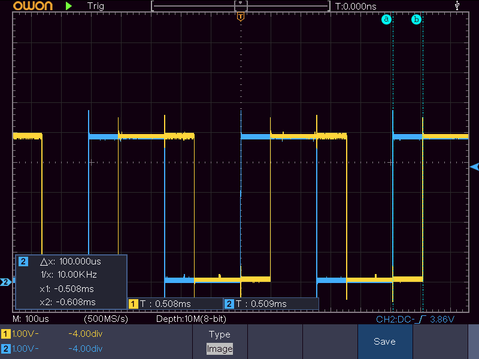
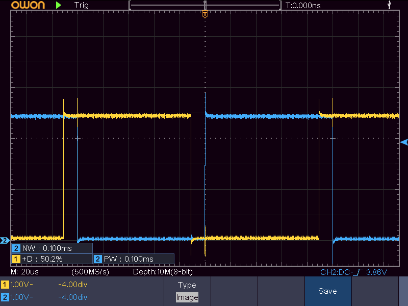
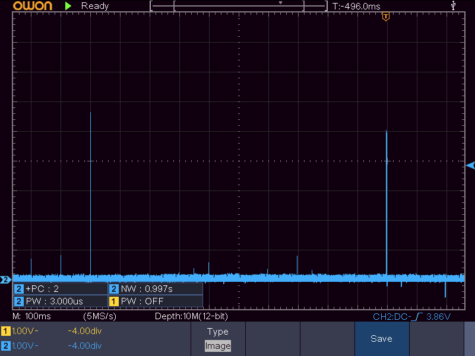
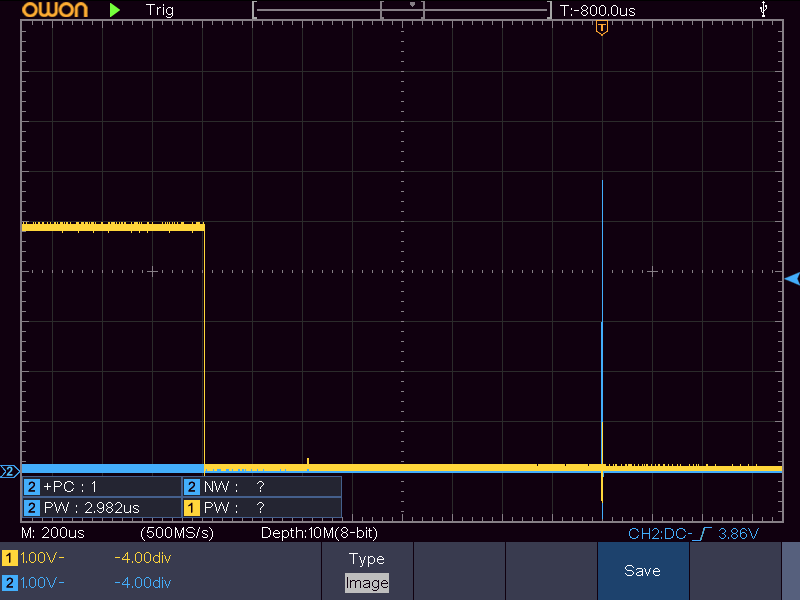
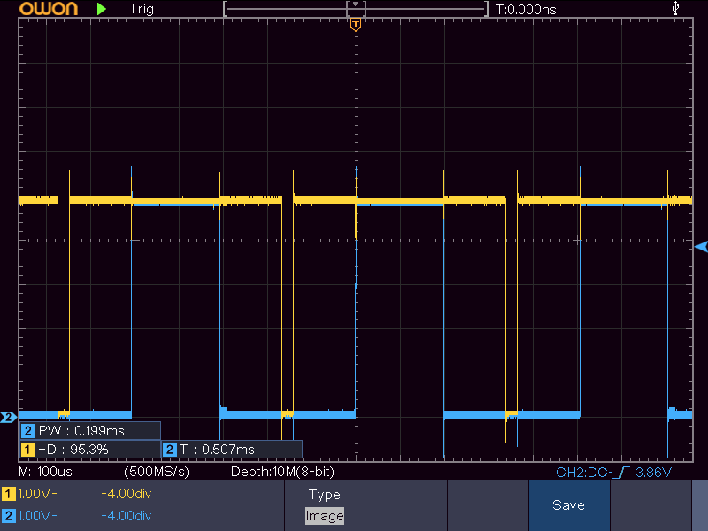
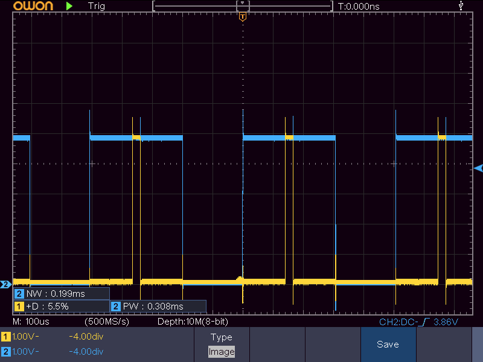

2026-02-15
# Muistiinpanoja ATtiny85 TIMER0 käytöstä

Osana assemblyn ja C:n yhdistelyä tutustuin vähän suorittimen kellon käyttöön. Yleinen käyttökohde assemblyn käytölle kun on juurikin tarkkojen ajoitusten luominen, kun tietää tarkkaan montako kellosykliä mikäkin homma vie. En myöskään ole TIMER-puolen hommiin ollenkaan koskenut, niin hyvä saada se tutuksi. Tämä itse kellon toiminta on vähän erillinen juttu yleisestä C:n ja assemblyn yhdistelystä, niin laitan omaksi erilliseksi dokumentiksi.

## TL;DR

Moodit mitä oikeasti tarvii, `COM0A/B 00` on kaikilla moodeilla että pinnit on vain normaaleja GPIO.

| WGM | COM0A/B | Toimintamoodi | Kello laskee       | Pinnit mätsissä                        |
|-----|---------|---------------|--------------------|----------------------------------------|
| 000 | 01      | Normaali      | Normaali 0..255    | Toggle                                 |
| 000 | 10      | Normaali      | Normaali 0..255    | Clear                                  |
| 000 | 11      | Normaali      | Normaali 0..255    | Set                                    |
| 010 | 01/10/11| Normaali (CTC)| Normaali 0..OCR0A  | Toggle/Clear/Set                       |
| 001 | 10      | PWM PC        | PWM PC   0..255..0 | Clear alhaalta ylös, set ylhäältä alas |
| 001 | 11      | PWM PC        | PWM PC   0..255..0 | Set alhaalta ylös, clear ylhäältä alas |
| 101 | 10/11   | PWM PC        | 0..OCR0A..0        | Clear / set ylöspäin mennessä          |
| 011 | 10      | PWM (fast)    | Normaali 0..255    | Clear mätsissä, set nollassa           |
| 011 | 11      | PWM (fast)    | Normaali 0..255    | Set mätsissä, clear nollassa           |
| 111 | 10/11   | PWM (fast)    | Normaali 0..OCR0A  | Set/clear, mutta OCR0A togglaa jos 11  |

## TIMER0

ATTinyn Timer/Counter0 on masiinan 8-bittinen kellokoneisto. Perusmuodossaan se laskee 0-255 uudestaan ja uudestaan, ja väliin voi pistää toimintapisteitä ja interrupteja. Useimmiten sitä ajetaan samalla keskuskellolla kuin muutakin systeemiä (IO-kello), mutta on kuitenkin oma erillinen alisysteeminsä. Sen vahvuus on siinä, että sillä voi generoida ajastettuja eventtejä interruptien kautta (`TIMER0_OVF`, `TIMER0_COMPA`, `TIMER0_COMPB`), mutta sen lisäksi sillä voi ajaa kanttiaaltomuotoja kahdella pinnillä ihan ilman interrupteja. Toisin sanottuna jos tarvii masiinaa jonkuntahtisen kanttiaallon tai kahden tuottamiseen, voi vaan pistää pinnit nakuttamaan ja tehdä keskusyksikön kellosykleillä jotain aikakriittistä tai muuten vaan tärkeää, tai laittaa vaikka koko masiinan lepotilaan ja säästää virtaa.

Kellon lähteenä voi käyttää IO-kelloa sellaisenaan tai hidastettuna 8/64/256/1024-osaan. Suorittimen perustaajuus on 8 MHz joka tehdasasetuksilla hidastettu 1 MHz. Tällöin tarjolla on aikaresoluutiot 1 µs, 8 µs, ..., 1024 µs per kelloyksikkö. Sen lisäksi voi käyttää nousevaa tai laskevaa reunaa `PB2`-pinnissä (`T0`). Kätevä jos haluaa laskea jotain ulkoisia eventtejä, vaikka että kymmenen napinpainalluksen jälkeen tapahtuu jotain mutta muuten nukutaan ja säästetään virtaa.

Kellon voi myös asettaa tiettyyn arvoon, mutta siinä on tiettyjä kommervinkkejä. Etenkin vertailumätsien arvot menee joissain toimintamoodeissa inee jonkun bufferin kautta, ja jos tekee juttuja väärässä järkässä niin saattaa käydä ettei bufferiarvot mene koskaan perille. Yleensä varmin rautalankaratkaisu on laittaa kello seis, säätää mitä ikinä haluaakaan kellokontrolleissa säätää ja sitten pistää kello takaisin käyntiin. Kello on seis kun bitit `CS02..CS00` on nollassa, eli varma malli on `fun_timer0.c` käytetty

```C
void setup_timer0(void){
    // Kello seis ja nolliin
    TCCR0B = 0x00;
    TCNT0 = 0x00;
    // Aseta Output Compare arvot
    OCR0A = VAL_OCR0A;
    OCR0B = VAL_OCR0B;
    // Aseta Control Register arvot, millä moodilla operoidaan
    // Kello lähtee käyntiin kun TCCR0B asetetaan
    TCCR0A = VAL_TCCR0A;
    TCCR0B = VAL_TCCR0B;
    // Aseta kellon arvo
    TCNT0 = VAL_TCNT;
    // Interrupti-enable
    TIMSK = VAL_TIMSK;
}
```
Kellovalintabitit `CS02..CS00` sijaitsee kaikki `TCCR0B` alapäässä, niin voimaratkaisu on kirjoittaa koko rekisteri nollaan ja laittaa sinne oikeat arvot vasta ihan tosi lopuksi.

## OCR0A ja OCR0B

Tarjolla on overflow-interruptin lisäksi kaksi mätsirekisteriä A ja B. Niissä olevia arvoja verrataan jatkuvasti `TCNT0` rullaavaan arvoon, ja kun ne on samat niin reagoidaan. Yleensä reaktio on että vastaavien pinnien `PB0` (A) ja `PB1` (B) arvoja sörkitään automaattisesti, tehdään interrupti, tai sekä että. Sörkkimisvaihtoehtoina on yleensä
- Ei mitään
- Vaihda tilaa
- Aseta
- Nollaa

`PB0` ja `PB1` arvot pitää `DDRB`-rekisterissä olla kohdillaan että mitään tapahtuu.

Sekä A että B toimii saman perustoiminnon ympärillä, ts. jos on valittu tietty toimintamalli timerille niin sekä A että B toimii sen mukaan. Esimerkiksi normaalimoodissa `OCR0A` ja `OCR0B` kautta voi vaikuttaa oikeastaan vain kanttiaaltojen vaihe-eroon ja molemmat tekee juttuja aina 255 syklin välein. Myöhemmin on avattu lisää eri toimintamalleja esimerkkien kautta.

Jos tarvitsee molempia vertailukanavia niin kannattaa aina laittaa luvuista isompi `OCR0A` ja pienempi `OCR0B`. Lähinnä relevantti CTC-moodissa, missä laskuri nollaa aina kun saavuttaa `OCR0A` arvon eikä `OCR0B` asti siksi koskaan päästäisi jos se olisi isompi, mutta hyvä pitää muutenkin rutiinina.

## Toimintamoodit

Timeria voi ajaa oikeastaan kolmella eri moodilla:
- Normaali & CTC : Laskuri laskee 0..255 uudestaan ja uudestaan
- PWM (Fast): Laskuri laskee 0..255 ja OCR0A/B operoi spesiaalisti
- PWM (Phase Correct): Laskuri laskee ees taas 0..255 ja takaisin 255..0

Kustakin moodista on tarjolla kaksi eri versiota: laskuri laskee joko täyteen 255 asti tai sitten `OCR0A` asti.

### Normaali WGM 000

Kello kulkee 0..255 ja hyppää takas 0.
Normaali moodi on todella yksinkertainen, eikä sovi oikein aaltomuotojen generointiin: ainoa aaltomuoto mitä saa on 255 kellotusta leveä 1:1 kanttiaalto, ainoa pelivara on kellon skaalauksessa ja siinä paljonko on vaihe-eroa `PB0` ja `PB1` signaalien välillä. Alla esimerkkikuva.

</img>

Esimerkkifunktiossa `clock_normal` on 100 µs vaihe-ero `PB0` ja `PB1` välillä koska `OCR0A` on 100 enemmän kuin `OCR0B`. Itse lukuarvot `OCR0A/B`-rekistereissä on aika mielivaltaisia, koska aaltogeneroinnissa molemmat toimii aina 255 syklin välein.

Enempi tämä moodi sopii asioiden oneshottina laskemiseen, esimerkiksi
- **Napinpainallusten laskeminen:** Laskuri nollaan, kellolähteeksi nouseva reuna `PB2`-pinnissä ja reagoidaan interruptilla kun on tullut N tapahtumaa (napinpainallusta tmv)
- **Viivästysfunktio:** Laskuri nollaan, kello käyntiin ja nukkumaan. Kun on kulunut `OCR0A/B` määräämä aika tulee triviaali interrupti (pelkkä `RETI`) ja ohjelman suoritus jatkuu seuraavasta rivistä.

### CTC WGM 010

Kello kulkee 0..`OCR0A` ja hyppää takas 0.
Tässä on jo enempi pelivaraa kuin normaalissa, kun laskuri palaa `OCR0A` saavutettuaan nollaan. Esimerkkifunktiossa `clock_ctc` säädetään `OCR0A` avulla 1:1-pulssin leveys arvoon 100 µs, ja `OCR0B` avulla kuinka paljon vaihe-eroa on `PB0` ja `PB1` pulsseilla.

</img>

Näin saadaan aikaan ajastettu AND-signaali: `PB0` ja `PB1` on samassa tilassa 10 µs kerrallaan (`OCR0B` verran) ja tapahtuman toistoväli on 100 µs (`OCR0A` verran).

Toinen esimerkki on tarkkojen ajoitusten luominen. Esimerkissä `clock_ctc_slow` laitetaan timer pyörimään 1/256-hidastetusti, ja tuottamaan 195 kellotuksen välein interrupti. Kun interruptiin on hypätty 20 kertaa, on aikaa kulunut 20 x 195 x 256 µs eli 0.998400 s. Tämän jälkeen vedetään pieni looppirumba ajan tappamiseksi ja **ta-daa**, saadaan mikrosekunnin tarkkuudella sekunnin välein toistuva tarkan levyinen pulssi ulos.

</img>

</img>

Jälkimmäisessä kuvassa `OCR0A` laitettu togglaamaan `PB0` tilaa, visualisoimaan kellon täyttymisen ja pulssin uloslaiton suhdetta.
Ikävä kyllä ATtiny85 sisäinen 8 MHz kello on niin epätarkka (lupaavat 10 % tarkkuutta) että tulokset oli vähän sinne päin...

### PWM (phase correct) WGM 001/101

Kello kulkee 0..255..0 tai 0..`OCR0A`..0
Saa luotua eri speksisiä aaltomuotoja: `PB0`/`PB1` on yhdessä tilassa aina kun ollaan 0 ja `OCR0A/B` välissä, ja toisessa tilassa kun lasketaan `OCR0A/B`..huippuarvo...takaisin alas `OCR0A/B`. Pulssi on siis sitä kapeampi, mitä lähempänä huippuarvoa mätsiarvo on.

</img>

Kuvassa näytetty WGM 001 arvoilla `OCR0A = 242` ja `OCR0B = 100`, jolloin `PB0` nakuttaa 95 % päällä/5 % pois (255*0.95 = 242) ja `PB1` on 200 sykliä päällä (100..0..100 alas mätsistä-nollassa-ylös mätsiin) ja pois päältä 310 sykliä (100..255..100 mätsistä ylös-huipulla-alas mätsiin).

Säätämällä `COM0A/B` saa helposti käännettyä samoilla lukuarvoilla kuvion päinvastaiseksi:

</img>

En vielä testannu reset @ `OCR0A` -versiota WGM 101.

### PWM (fast) WGM 011/111

Kello kulkee 0..255 (011) tai 0..`OCR0A` ja hyppää takas 0.
Hyvä siihen että saa luotua nopeita pulsseja valitun pituisilla intervalleilla, ilman interrupt-lähestymiskulmaa. Faasikorjattuun PWM nähden on mahdollista saada tuplasti korkeampia taajuuksia, johtuen ihan siitä että nollasta nollaan on puolet vähemmän syklejä (nollasta ylös, ylhäältä nollaan vs. nollasta ylös).

Dokumentaatiosta olin ymmärtävinäni että jos laittaa `WGM = 111` ja `COM0A = 10/11`, `PB0` togglaa mätsissä eikä tee mitään nollassa, eli sylkee ulos 50 % duty cycle valitulla taajuudella. Jos siis tarvitsee tosi lyhyitä pulsseja tosi nopealla taajuudella, se on tehtävä `PB1`/`OCR0B` kautta.

Tätä en vielä testannut niin ei kuvia.